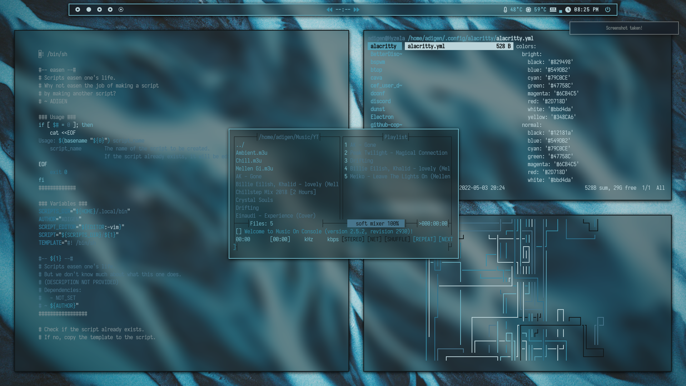
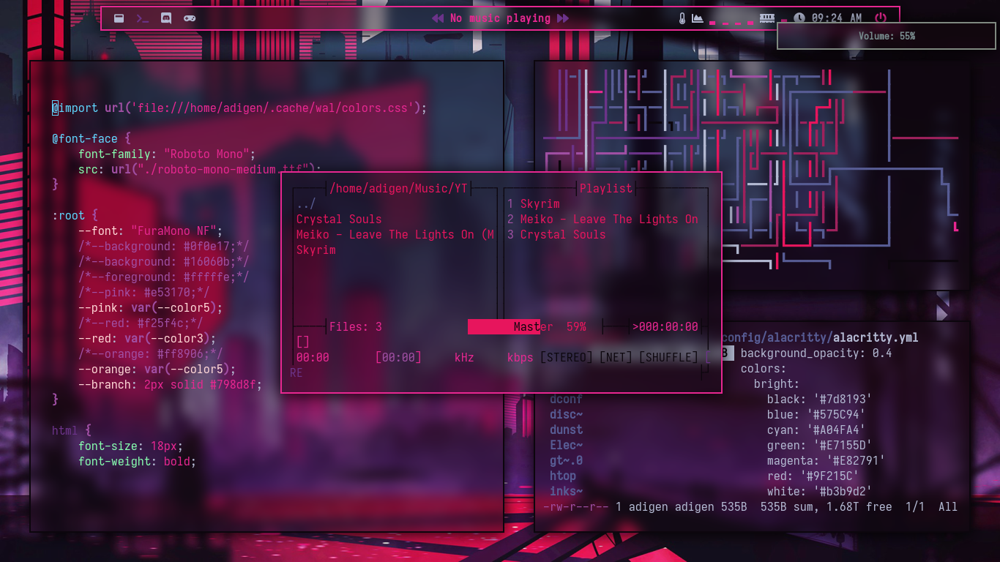
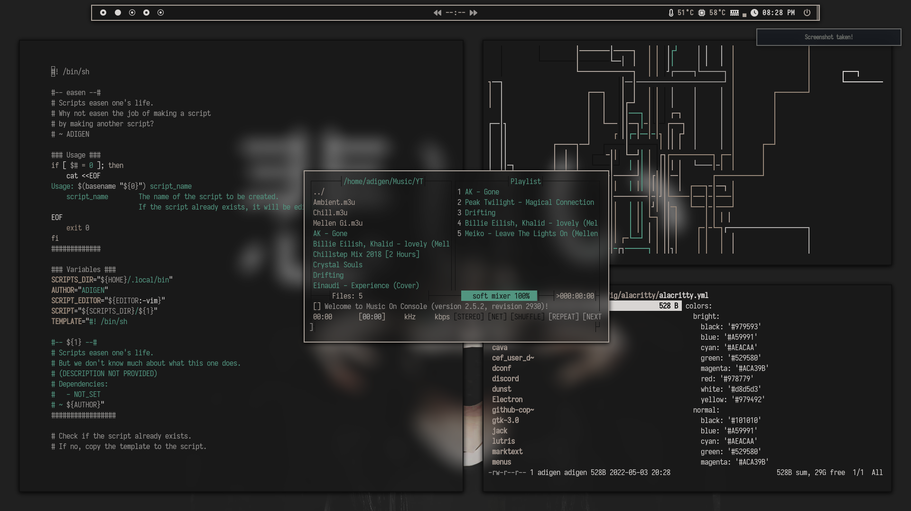
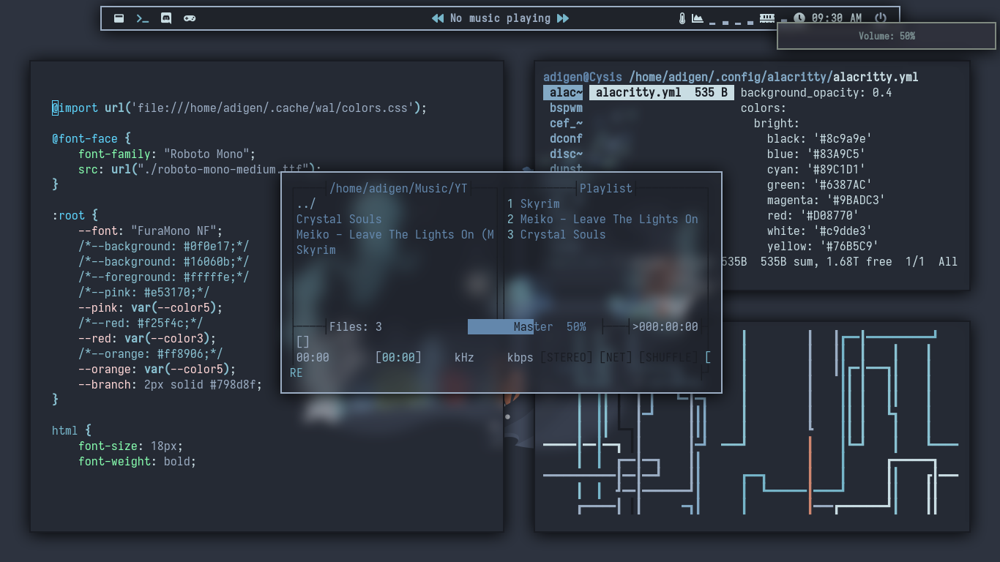
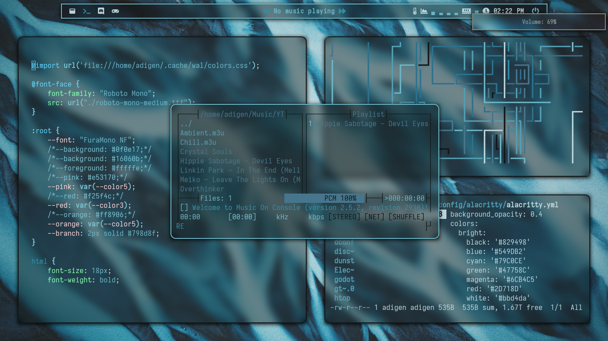

# Dotfiles

Dotfiles for my bspwm rice on Arch Linux. This rice contains multiple themes, which can be choosen by pressing `Super + T`.

---

# Theme (w/o blur):

## Mountain

---

## Yosemite

---

# Themes (w/ blur):

## Blue

---

## Nyt

---

## Cysis

---

## Japan

(idk what it is in the background wallpaper pls dont get offended :D)

---

## Nord

---

## Same themes can be applied with rounded corners:

---

### Applications visible in screenshot above (from top left):

- [bspwm](https://github.com/baskerville/bspwm) [window manager]
- [polybar](https://github.com/polybar/polybar) [top bar]
- [dunst](https://github.com/dunst-project/dunst) [notifications]
- [alacritty](https://github.com/alacritty/alacritty) [terminal emulator]
- [neovim](https://github.com/neovim/neovim) [text editor] (With the [Goyo](https://github.com/junegunn/goyo.vim) extention)
- [ranger](https://github.com/ranger/ranger) [file manager]
- [mocp](https://github.com/jonsafari/mocp) [music player]
- [pipes.sh](https://github.com/pipeseroni/pipes.sh) [just for visuals :)]
- [qutebrowser](https://github.com/qutebrowser/qutebrowser) [web browser] (Older browser was [vivaldi](https://vivaldi.com/))
- ~[neofetch](https://github.com/dylanaraps/neofetch) [terminal fetch for info]~
- fet [a custom fetch script definitely not stolen from [them](https://github.com/safinsingh/)]
- ~[rofi](https://github.com/davatorium/rofi) [application opener]~
- [dmenu](https://tools.suckless.org/dmenu/) [application opener] (With [j4-dmenu-desktop](https://github.com/enkore/j4-dmenu-desktop) for .desktop files)

### Etc.

- [picom](https://aur.archlinux.org/packages/picom-ibhagwan-git/) [compositor]
- [ohmyzsh](https://github.com/ohmyzsh/ohmyzsh) [shell]
- [feh](https://github.com/derf/feh) [image viewer and wallpaper setter]
- [pywal](https://github.com/dylanaraps/pywal) [theme color generator from wallpaper]
