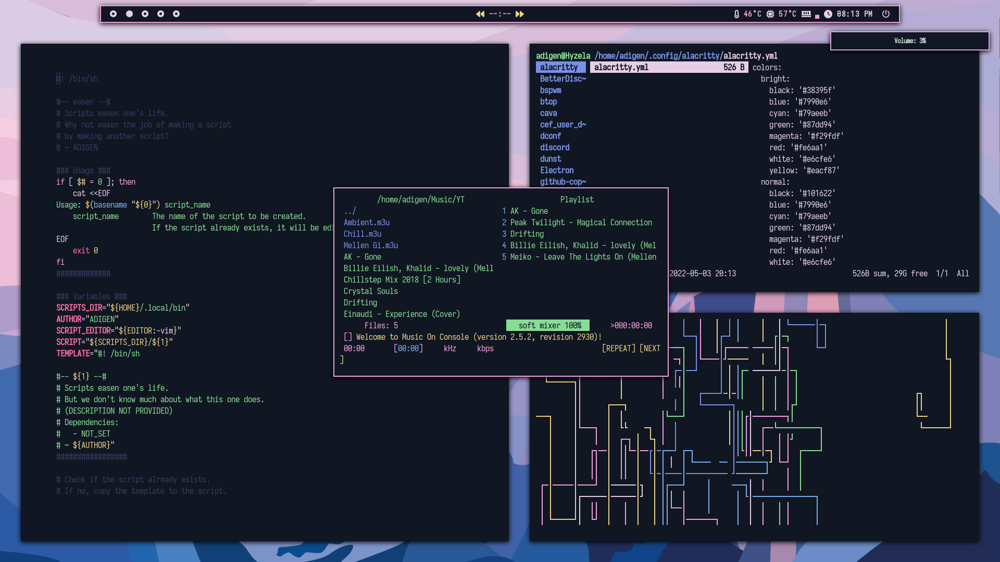

## Dotfiles

### Applications

-   **Distro**: [Arch](https://archlinux.org)
-   **Window manager**: [bspwm](https://github.com/baskerville/bspwm)
-   **Top bar**: [polybar](https://github.com/polybar/polybar)
-   **Notifications**: [dunst](https://github.com/dunst-project/dunst)
-   **Terminal**: [alacritty](https://github.com/alacritty/alacritty)
-   **Font**: [Iosevka](https://github.com/be5invis/Iosevka) + Nerd fonts
-   **Text editor**: [neovim](https://github.com/neovim/neovim) with [NvChad](https://nvchad.com) running on [Neovide](https://neovide.dev)
-   **File manager**: [ranger](https://github.com/ranger/ranger)
-   **Application opener**: [rofi](https://github.com/davatorium/rofi)
-   **Music player**: [mocp](https://github.com/jonsafari/mocp)
-   **Web browser**: [Brave](https://brave.com)
-   **Startup shell script**: [fet](https://github.com/mradigen/dotfiles/blob/main/.local/bin/fet) (definitely not stolen from [them](https://github.com/safinsingh/))
-   **Visual candy**: [pipes.sh](https://github.com/pipeseroni/pipes.sh)
-   **Compositor (blur and animations)**: [picom](https://github.com/FT-Labs/picom)
-   **Shell**: [ohmyzsh](https://github.com/ohmyzsh/ohmyzsh)
-   **Image viewer**: [feh](https://github.com/derf/feh)
-   **Themer**: [pywal](https://github.com/dylanaraps/pywal)

### Previously used:

-   ~Web browser: [qutebrowser](https://github.com/qutebrowser/qutebrowser)~
-   ~Web browser: [vivaldi](https://vivaldi.com/)~
-   ~Application opener: [dmenu](https://tools.suckless.org/dmenu/) (With [j4-dmenu-desktop](https://github.com/enkore/j4-dmenu-desktop) for .desktop files)~

### Inspirations

-   [adi1090x](https://github.com/adi1090x)

---

## [NEW] Pastel Gradient Wallpaper

[wallgrad](https://github.com/mradigen/dotfiles/blob/main/.local/bin/wallgrad) can generate random (yet beautiful-looking) pastel gradient wallpapers. For example:

|           | Green                                                                                        | Purple                                                                                         |
| --------- | -------------------------------------------------------------------------------------------- | ---------------------------------------------------------------------------------------------- |
| Wallpaper |  |  |
| Rice      |      |      |

---

### Mountain

---

### Yosemite

---

## Themes (w/ blur):

<!-- ## Blue -->
<!---->
<!--  -->
<!---->
<!-- --- -->
<!---->
<!-- ## Nyt -->
<!---->
<!--  -->
<!---->
<!-- --- -->
<!---->
<!-- ## Cysis -->
<!---->
<!--  -->
<!---->
<!-- --- -->
<!---->
<!-- ## Japan -->
<!---->
<!--  -->
<!---->
<!-- --- -->

## Nord

---
