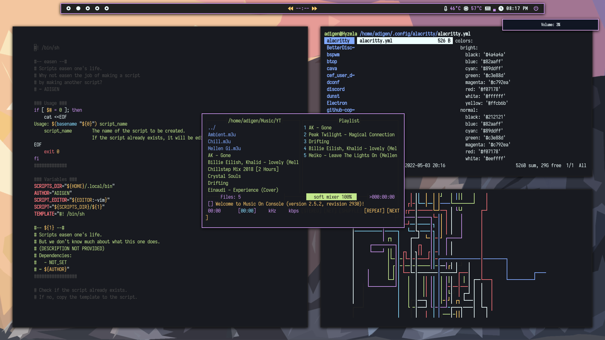

## Dotfiles

Recently migrated from bspwm, so everything here is a WIP

Screenshots soon!

<!--  -->

<!-- 

<!-- This rice contains multiple themes, which can be choosen by pressing `Super + T`. -->
<!---->
<!-- You can also press `Super + Shift + h` in order to get a help on sxhkd shortcuts. -->

### Applications

-   **Distro**: [Arch](https://archlinux.org)
-   **Window manager**: [niri](https://github.com/niri-wm/niri)
-   **UI Shell**: [DankMaterialShell](https://danklinux.com/)
-   **Terminal**: [alacritty](https://github.com/alacritty/alacritty)
-   **Font**: [Iosevka](https://github.com/be5invis/Iosevka) + Nerd fonts
-   **Text editor**: [neovim](https://github.com/neovim/neovim)
-   **File manager**: [ranger](https://github.com/ranger/ranger)
-   **Web browser**: [Microsoft Edge](https://www.microsoft.com/en-us/edge) (I promise there is a very compelling reason to this that I shall blog one day)
-   **Shell**: [ohmyzsh](https://github.com/ohmyzsh/ohmyzsh)
-   **Themer**: [matugen](https://github.com/InioX/matugen)

<!-- --- -->
<!---->
<!-- ## [NEW] Pastel Gradient Wallpaper -->
<!---->
<!-- [wallgrad](https://github.com/mradigen/dotfiles/blob/main/.local/bin/wallgrad) can generate random (yet beautiful-looking) pastel gradient wallpapers. For example: -->
<!---->
<!-- |           | Green                                                                                        | Purple                                                                                         | -->
<!-- | --------- | -------------------------------------------------------------------------------------------- | ---------------------------------------------------------------------------------------------- | -->
<!-- | Wallpaper |  |  | -->
<!-- | Rice      |      |      | -->
<!---->
<!-- --- -->
<!---->
<!-- 
 -->
<!---->
<!-- ### Mountain -->
<!---->
<!-- 
 -->
<!---->
<!--  -->
<!---->
<!-- --- -->
<!---->
<!-- 
 -->
<!---->
<!-- ### Yosemite -->
<!---->
<!-- 
 -->
<!---->
<!--  -->
<!---->
<!-- --- -->
<!---->
<!-- 
 -->
<!---->
<!-- ## Themes (w/ blur): -->
<!---->
<!-- 
 -->
<!---->
<!---->
<!-- 
 -->
<!---->
<!-- ## Nord -->
<!---->
<!-- 
 -->
<!---->
<!--  -->
<!---->
<!-- --- -->
