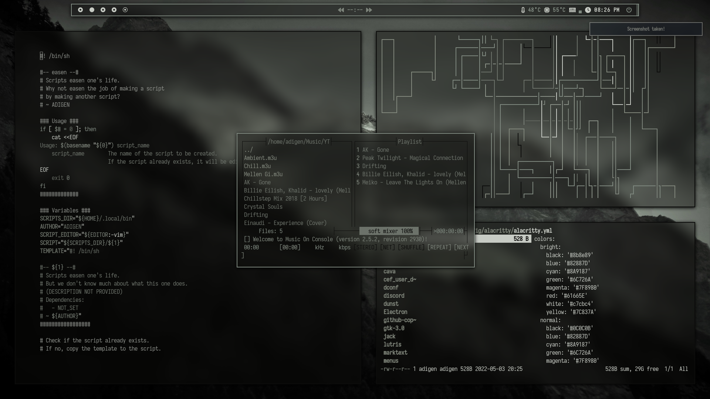

# Dotfiles
Dotfiles for my bspwm rice on Arch Linux. This rice contains multiple themes, which can be choosen by pressing `Ctrl + T`.

## Nyt

## Cysis

### Applications visible in screenshot above (from top left):

- [bspwm](https://github.com/baskerville/bspwm) [window manager]
- [polybar](https://github.com/polybar/polybar) [top bar]
- [dunst](https://github.com/dunst-project/dunst) [notifications]
- [alacritty](https://github.com/alacritty/alacritty) [terminal emulator]
- [kakoune](https://github.com/mawww/kakoune) [text editor]
- [ranger](https://github.com/ranger/ranger) [file manager]
- [mocp](https://github.com/jonsafari/mocp) [music player]
- [pipes.sh](https://github.com/pipeseroni/pipes.sh) [just for visuals :)]
- [vivaldi](https://github.com/mawww/kakoune) [web browser] (will upload config and settings in the future :D)
- [neofetch](https://github.com/dylanaraps/neofetch) [terminal fetch for info]
- [rofi](https://github.com/davatorium/rofi) [application opener]

### Etc.
- [compton](https://aur.archlinux.org/packages/picom-ibhagwan-git/) [compositor]
- [ohmyzsh](https://github.com/ohmyzsh/ohmyzsh) [shell]
- [feh](https://github.com/derf/feh) [image viewer and wallpaper setter]
- [pywal](https://github.com/dylanaraps/pywal) [theme color generator from wallpaper]
- [wallpaper](https://pixabay.com/photos/dreary-storm-mountains-drama-mood-4453740/)

